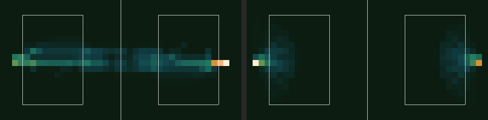

# 2D Tennis Simulator

AIエージェント同士が対戦しながら学習していく過程を観察するシミュレーター。
「ホームポジションに戻る」などの基本戦術が強化学習によって自然発生するか、神視点で楽しむことを目的としています。

**▶ 試合を観る（スマホ対応）: https://sashi7446.github.io/2DTennisSimulator/**

## 特徴

- AI vs AI のリアルタイム対戦観戦
- 実況ログ・ラリーカウンター・最長ラリー記録の表示
- 打球音とヒットエフェクト（音源ファイル不要・numpyで合成）
- スマホで観れるリプレイビューア（GitHub Pages / サーバー不要）
- Policy Gradient（REINFORCE）による学習エージェント
- 学習過程をグラフで可視化（デバッグモード）
- 滞在位置ヒートマップ（観戦中に `H`、または PNG 書き出し）
- エージェントの保存・読み込み機能
- 複数のエージェントタイプ（ルールベース/学習型）

## インストール

```bash
pip install pygame numpy
```

## クイックスタート

```bash
# AI同士の対戦を観戦
python main.py

# 学習エージェント vs ルールベースAI（デバッグ表示付き）
python main.py --agent-a neural --agent-b chase --debug

# 利用可能なエージェント一覧
python main.py --mode list
```

## エージェントタイプ

| タイプ | 説明 |
|--------|------|
| `chase` | ボールを追いかけるシンプルなAI（デフォルト） |
| `smart` | チェイスに10フレーム先の外挿を足しただけ。前後の戦略はない |
| `baseliner` | 守備的にベースライン付近で拾い続けるAI |
| `positional` | 位置取り優先のAI |
| `intercept` | 到達可能な迎撃点へ先回りし、空いたら後方センターへ戻る |
| `solver` | 打球角度を全探索し、相手が届かない一手を選ぶ（最強の非学習AI） |
| `random` | ランダム行動（ベースライン比較用） |
| `neural` | Policy Gradientで学習するニューラルネットワークAI |
| `transformer` | Attention機構を用いた高度なモデル（Transformer） |

## 使い方

### 対戦観戦モード

```bash
# 基本（chase vs chase）
python main.py

# エージェント指定
python main.py --agent-a neural --agent-b smart

# デバッグモード（報酬グラフ表示）
python main.py --agent-a neural --agent-b chase --debug

# ボール速度・勝利ポイント変更
python main.py --speed 7.0 --points 21

# 消音（オーディオデバイスが無い環境では自動的に無音）
python main.py --mute
```

### 画面の見方（デスクトップ版）

| 表示 | 意味 |
|------|------|
| 赤い丸（左） / 青い丸（右） | Player A / Player B |
| 丸のまわりの薄い円 | リーチ範囲。ここにボールが入らないと打ち返せない |
| 明るい黄色のボール | イン状態。壁に当たれば打った側の**得点** |
| 暗い黄色のボール | 未通過。壁に当たれば打った側の**失点**（アウト） |
| 打点から広がるリング | そのフレームで打ち返した |
| 左下のログ | 実況。新しいものが上、古いものほど薄くなる |
| `Rally: 3 (best 12)` | 現在の往復数と、起動してからの最長記録 |
| `NEW RECORD! 12 RALLIES` | 最長ラリー更新 |
| `Game Over! Player B wins! (in)` | 決着と、その理由（`in` = 決めた / `out` = ミス） |

音は打球速度でピッチが変わり、**ポイントは `in` なら上昇音、`out` なら下降音**が鳴ります。
`--mute` で消音、オーディオデバイスが無い環境では自動的に無音になります。

### キー操作

| キー | 動作 |
|------|------|
| `D` | デバッグ表示の切り替え |
| `H` | ヒートマップ切り替え（両者 → A → B → オフ） |
| `S` | エージェントを保存（--save-dir指定時） |
| `R` | ゲームリセット |
| `ESC` | 終了 |

### ヘッドレス学習モード

高速学習用（描画なし）：

```bash
# 100エピソード学習
python main.py --mode headless --agent-a neural --agent-b neural --episodes 100

# エージェントを保存しながら学習
python main.py --mode headless --agent-a neural --agent-b chase --episodes 500 --save-dir saved_agents
```

### エージェントの保存と読み込み

```bash
# 学習しながら保存
python main.py --agent-a neural --agent-b chase --save-dir my_agents --debug

# 保存したエージェントを読み込んで対戦
python main.py --agent-a my_agents/agent_a_neural --agent-b chase

# 保存済みエージェント同士の対戦
python main.py --agent-a saved/champion_v1 --agent-b saved/champion_v2
```

## ヒートマップ（どこに居たか）

このプロジェクトの問い —— **「ホームポジションに戻る戦術は自然発生するか」** ——
に答えるための画。各プレイヤーが**どのマスに何フレーム居たか**を 40×20 で数え、
色にして出す。打った瞬間のフレームと待機中のフレームは分けて集計している
（**待機位置はAIが選んだ結果**だが、打点はボールに強制されるため）。

### 観戦中に重ねる

`H` を押すたびに 両者 → A のみ → B のみ → オフ と切り替わる。
デバッグモード専用ではないので、通常の観戦中でも使える。
試合を眺めているうちに、そのAIの「居場所」が滲み出てくる。

### 記録して画像に出す

```bash
# 学習・対戦しながら位置を記録（可視モードでも同じフラグが使える）
python main.py --mode headless --agent-a chase --agent-b chase \
    --episodes 300 --heatmap-out heatmaps/chase.npz

# PNG に描き出す
python heatmap.py heatmaps/chase.npz --out heatmap.png

# 2つを並べて比較（同じ色スケールで揃えるなら --shared-scale）
python heatmap.py --compare heatmaps/gen_001.npz heatmaps/gen_050.npz \
    --out growth.png --shared-scale

# プレイヤー・フェーズを絞る
python heatmap.py heatmaps/chase.npz --player a --phase idle --out a_idle.png
```

`--phase` は `all` / `idle`（待機中）/ `hit`（打った瞬間）。
描画は zlib と numpy だけで PNG を書く。matplotlib は要らない。

### 読める例



左が `chase` 同士、右が `intercept` 同士（各300エピソード）。

- **chase**: コート中央の横一線に伸びている。ボールを追って左右に往復し続けるだけで、
  戻る場所を持っていない
- **intercept**: 自陣の定位置に固まっている。ラリーの合間に後方センターへ戻る挙動が、
  そのまま濃い塊として出ている

つまり **「戻る場所を持つ」振る舞いは、ヒートマップの形として一目で見分けられる**。
学習エージェントの世代を並べれば、それが自然発生したかどうかも同じ図で判定できる。

## デバッグモード

`--debug` フラグで以下の情報を表示：

- ボールの位置・速度・インフラグ状態
- 各プレイヤーの位置・状態
- 報酬グラフ（4種類）：
  - Player A 累積報酬（エピソード単位）
  - Player A 5エピソード移動平均
  - Player B 累積報酬（エピソード単位）
  - Player B 5エピソード移動平均

## スマホで観る（リプレイビューア）

**https://sashi7446.github.io/2DTennisSimulator/**

録画した試合を静的HTMLで再生します。サーバー不要、pygame も Python も不要。
iPhone なら Safari の共有 →「ホーム画面に追加」でアプリのように使えます。

上部の対戦表が全カードの一覧です。総当たり（同キャラ戦を含む）が録画済みで、
セルをタップするとそのカードに切り替わります。カードは選ばれたときに初めて
読み込まれるので、開いた直後の通信は1カード分だけです。

### 操作

| 操作 | 動作 |
|------|------|
| 対戦表のセル | そのカードに切り替え |
| コートをタップ | 再生 / 一時停止 |
| ⏮ / ⏭ | 前 / 次のカード |
| 🔁 | オート送り。全カードを順に流し見する（既定でオン） |
| 1.0x | 再生速度（1.0x → 2.0x → 0.5x） |

ポイントが決まると自動で次のポイントへ進み、最後のポイントが終わると
オート送りが次のカードへ移ります。

### 画面の見方

| 表示 | 意味 |
|------|------|
| 🔴 赤い丸（左） | Player A |
| 🔵 青い丸（右） | Player B |
| 丸のまわりの薄い円 | リーチ範囲。**ここにボールが入らないと打ち返せない** |
| 中央の明るい四角 | インエリア |
| 明るい黄色のボール | イン状態。打ち返せる／壁に当たれば打った側の**得点** |
| 暗い黄色のボール | まだインエリアを通過していない。壁に当たれば打った側の**失点**（アウト） |
| ボールの尾 | 直近の軌跡 |
| 打点から広がる白いリング | そのフレームで打ち返した |
| ヘッダの `ball 15 · player 4 · reach 30` | その試合を録った設定 |
| `Point 3/10  Rally 12` | ポイント番号と、現時点までの往復数 |
| 🔥 LONGEST RALLY | そのポイントが録画中の最長ラリー |
| `SmartChaseBot WINS (IN)` | 決着。`IN` は決めて得点、`OUT` はミスで失点 |

上下のスコアは、それまでのポイントの勝敗を積み上げたものです。

## 試合を録画する

### スマホから（GitHub Actions）

GitHubアプリまたはブラウザで **Actions → Record Matchups → Run workflow** を開いて
実行します。全エージェントの総当たり（同キャラ戦を含む）をGitHub側で録画し、
ビューアの対戦表に並べます。

| 入力 | 内容 |
|------|------|
| `agents` | 対戦させるAIの名前をスペース区切りで。既定は7種すべて |
| `points` | 1カードあたりのポイント数（既定10） |
| `force` | 既に録画済みのカードも録り直す |

**録画済みのカードは再利用されます。** 新しいAIを書いて `create_agent()` に追加し、
`agents` の末尾にその名前を足して実行すれば、増えたカードだけが録画されます。

### ローカルから

```bash
# 全カードを録画する（docs/replays/ に1カード1ファイル）
python record_matrix.py

# 一部のエージェントだけ
python record_matrix.py --agents chase smart solver

# 録画済みのカードも含めて録り直す
python record_matrix.py --force

# 1カードだけを設定を変えて録る（docs/replay.js に出力。対戦表には並びません）
python record_replay.py --agent-a smart --agent-b smart --speed 8
```

`docs/index.html` をブラウザで開けばそのまま再生できます（`file://` でも動作）。
公開するには `docs/replays/` と `docs/index.html` をコミットして push してください
（録画時に `index.html` の読み込みURLへ内容ハッシュが付与されるため、両方必要です）。

> GitHub Pages の設定は **Settings → Pages → Source: main / docs**。

### 設定を変えるときの注意

**`player_speed` を上げてはいけません。** ボール速度15に対してプレイヤー速度4という比は、
「反応では間に合わないので予測して先に動くしかない」状況を作っています。
このプロジェクトが観察したい**位置取りや予測が生まれる余地はここから来ています。**

プレイヤー速度を8にすると、ボールを見てから追いかければ間に合うようになり、
予測の価値が消えます（`chase` の `smart` に対する勝率が 3% → 18% に上がります）。
ボール速度8とプレイヤー速度8を同時に指定すると**ポイントが永久に決まりません。**

ラリーを長くしたいなら、**プレイヤー速度は 4.0 のまま、ボール速度だけ下げてください。**

| 設定 | smart vs smart の平均ラリー |
|------|------------------------------|
| ball 15.0（デフォルト） | 3.1 |
| ball 12.0 | 5.0 |
| ball 8.0 | 7.5 |
| ball 8.0 + **player 8.0** | 決着せず（打ち切り） |

`baseliner` 同士はデフォルト設定でもポイントが決まりません。
録画は1ポイント1800フレームで打ち切り、その旨を警告します。

記録されるのはボール・プレイヤーの座標と打球イベントのみ。
サイズはラリーの長さ次第で、1ポイントあたり数KB（短い決着）〜20KB程度（長いラリー）です。
再生側は canvas で描き直しています。

## Gymnasium環境

強化学習ライブラリとの連携用：

```python
from env import TennisEnv, SinglePlayerTennisEnv
import numpy as np

# 2プレイヤー環境
env = TennisEnv(render_mode="human")
obs, info = env.reset()

# アクション: (移動方向 0-16, 打つ角度)
action = (0, np.array([45.0]))
obs, reward, terminated, truncated, info = env.step(action)

# シングルプレイヤー環境（相手は自動AI）
env = SinglePlayerTennisEnv(opponent_policy="chase")
```

## ゲームルール

### フィールド
- 壁で囲まれた長方形のフィールド
- 中央に2つの「インエリア」（3:2比率、間に隙間）

### インフラグシステム
- ボールがインエリアを通過 → インフラグON
- プレイヤーが打ち返す → インフラグOFFにリセット

### ポイント判定
ボールが壁に到達した時：
- インフラグON → 打った側の**得点**
- インフラグOFF → 打った側の**失点**（アウト）

### 打ち返し条件
- ボールがリーチ距離内にある
- インフラグがONである

両方を満たす場合のみ打ち返し可能。

## 設定パラメータ

`config.py` で調整可能：

```python
Config(
    # フィールド
    field_width=800,
    field_height=400,

    # インエリア
    area_width=200,
    area_height=300,
    area_gap=250,

    # ボール
    ball_speed=15.0,
    serve_angle_range=15.0,

    # プレイヤー
    player_speed=4.0,
    reach_distance=30.0,

    # 報酬（詳細は下記参照）
    reward_point_win=1.0,
    reward_point_lose=-1.0,
    reward_rally=0.1,
    reward_in_area=0.05,
    reward_step=0.0,
)
```

## 報酬トリガー

強化学習エージェントに与える報酬は、5種類のトリガーで発生します：

| トリガー | パラメータ | デフォルト | 発生タイミング |
|----------|------------|------------|----------------|
| ヒット時 | `reward_rally` | `0.1` | ボールを打ち返した時 |
| イン時 | `reward_in_area` | `0.05` | 打ったボールがインエリアを通過した時 |
| ポイント獲得時 | `reward_point_win` | `1.0` | ポイントを獲得した時 |
| ポイント喪失時 | `reward_point_lose` | `-1.0` | ポイントを失った時 |
| 時間経過 | `reward_step` | `0.0` | 毎ステップ（両プレイヤーに適用） |

### 報酬設計の例

```python
# デフォルト: スパース報酬（ポイント獲得/喪失のみ重視）
Config()

# 早くゲームを終わらせるよう促す設定
Config(reward_step=-0.001)

# ラリーを重視する設定
Config(reward_rally=0.5, reward_in_area=0.2)

# 純粋なスパース報酬（ポイントのみ）
Config(reward_rally=0.0, reward_in_area=0.0, reward_step=0.0)
```

## ファイル構成

```
├── main.py          # エントリーポイント（CLI）
├── config.py        # 設定パラメータ
├── field.py         # フィールドとインエリア
├── ball.py          # ボールの挙動とインフラグ
├── player.py        # プレイヤーの移動と打ち返し
├── game.py          # ゲームロジック
├── renderer.py      # Pygame描画（デバッグオーバーレイ含む）
├── env.py           # Gymnasium環境
├── debug.py         # デバッグログ・バリデーション
├── audio.py         # 効果音の合成（numpy波形生成）
├── record_replay.py # 1カードのリプレイ録画
├── record_matrix.py # 全カードを総当たりで録画（docs/replays/ を生成）
├── docs/            # スマホ向けリプレイビューア（GitHub Pages）
│   ├── index.html   # 単体で動く再生プレイヤー（依存ゼロ）
│   └── replays/     # 対戦表と1カード1ファイルの録画データ（生成物）
├── agents/          # エージェントシステム
│   ├── __init__.py
│   ├── base.py      # 基底クラス（save/load）
│   ├── chase.py     # ChaseAgent, SmartChaseAgent
│   ├── baseliner.py # BaselinerAgent
│   ├── positional.py    # PositionalAgent
│   ├── random_agent.py  # RandomAgent
│   ├── neural.py    # NeuralAgent（Policy Gradient）
│   └── transformer.py   # TransformerAgent
└── tests/           # ユニットテスト（96テスト）
```

## テスト

```bash
python -m unittest discover tests/ -v
```

## 新しいエージェントの作成手順 (Cheat Sheet)

新しいAIを追加してシミュレーターで動かすための最短ステップです。

### 1. `agents/new_agent.py` を作成
`agents/base.py` の `Agent` クラスを継承して実装します。

```python
from agents.base import Agent

class MyNewAgent(Agent):
    def act(self, observation):
        # observation（辞書型）を受け取り、(移動方向, 打球角度)を返す
        # 移動方向: 0-15 (22.5度刻み), 16 (静止)
        # 打球角度: 0-360度 (実数値)
        return 16, 0.0

    def learn(self, reward, done):
        # 報酬を受け取って学習するロジック（任意）
        pass
```

### 2. `agents/__init__.py` に登録
```python
from agents.new_agent import MyNewAgent
# __all__ への追加も忘れずに
```

### 3. `main.py` の追加
`create_agent` 関数内に選択肢を追加します。

```python
# main.py の create_agent 内
elif agent_type == "my_new":
    agent = MyNewAgent()
```

### 4. 実行
```bash
python main.py --agent-a my_new --agent-b chase
```

`create_agent` に追加した時点で、GitHub Actions の **Record Matchups** の
`agents` に `my_new` を足すだけで対戦表に並びます（ワークフローの編集は不要）。

---

## ライセンス

MIT
